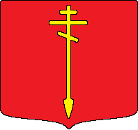

# Muscovites

### A Siege and Defensive civilization

## Goals

 - My goal here was to workshop a realistic split of the current Slavs civilization. This civilization would be one of the primary civilizations to be covered by this, and is loosely inspired by RobbyLAVA's idea for the Muscovites (as attested in [How much can AoE2 split the SLAVS?](https://www.youtube.com/watch?v=blHK7Q8lChI)), that I later expanded on in my contribution to [My Discord Server designs an AOE2 DLC... Blind (Exquisite Corpse #2)](https://www.youtube.com/watch?v=rgsbxVjbPxk).
 - My starting idea was that this civ should expand across the map quickly and have ways to keep control over vast swaths of territory. I expanded this to a broad gunpowder affinity, to differentiate them from other Slavs split civilizations. Finally, I wanted a tertiary accent on trade, as Moscow grew to early prominence largely as a hub of trade. These three would work together to create a civ that would expand across the map early and strongly.

 ## Scope

 - **This civilization is intended to very generally represent the northern East Slavic states that eventually coalesced to form the modern state of Russia.** More specifically, I would specify the inclusion of states that were conquered and ruled by the Mongols. This is specifically to exclude the Ruthenians, a future build which would be based on the Kievan Rus and the cultures that would evolve into the modern state of Ukraine, which spent more time under Lithuanian and later Polish-Lithuanian influence, and also to exclude the Republic of Novgorod, which was naturally quite different to Muscovy due to not being subjugated by the Mongols, being a republic, and operating largely in the Scandinavian cultural and economic sphere, in addition to the East Slavic one. This is, however, intended to encompass more minor East Slavic states like Tver, Yaroslavl, Rostov, Ryazan, Smolensk and others which would largely overlap with the Muscovite civilization.
 - As such, the history that I draw inspiration from will largely be from the Late Medieval and Early Modern periods, starting with the rise of Moscow as a trade hub in the 13th century and concluding with the end of the AoE2 time period (1600) just as Russia was expanding into Siberia.
 - I have not consulted, and am not even aware of any current builds for a Russian or Muscovite civilization.

 ## Name

 - A more obvious civilization name for this civilization might be **The Rus** or just **Rus**, but I decided against it for a few reasons.
   - Primarily, it is not specific enough - the term Rus would refer to almost the entire East Slavic civilization as it is currently represented by the Slavs civilization, so while it would be a better name for that, it represents too wide a cultural umbrella for the scope of this build.
   - Additionally, it is a culturally contentious term in modern times, due to differing historical interpretations of its legacy and its implications for modern nations. Consider why *Teutons* was used instead of *Germans*, *Franks* instead of *French*, *Saracens* instead of *Arabs*, even with civilizations with much more clear-cut scope boundaries.
 - Another potential alternative name could have been **Russians**, which would at least only hit the first of the three reasons mentioned above, as well as having more pop-culture recognizability.
   - If the civ's scope had included both the Muscovites and Novgorod as outlined above, I might have considered this.
   - However, this name would, for lack of a better phrase, treat history as inevitable, by applying a term with a modern recontextualized meaning to a medieval setting.

## Civilization Bonuses

 - **Fur Trade**
   - Hunters deposit additional gold equal to 20% of the food being deposited.
   - Scouts and Cavalry Archers can gather from huntable animals, with 2x the carry capacity of a Villager.
   - This is largely a callback to the Age of Empires 4 version of the Rus, which have a similar bonus.
   - While not unique among fur trading centers, the prevalence and volume of fur trading in the region provides some historical justification to the bonus. Fur trading was one of the first institutions implemented in newly conquered territories as Muscovy/Russia expanded eastward.
   - This is intended to provide the Muscovites with a strong Dark Age and encourage either drushing or encourage Feudal Scout play.
   - This will provide around 200 gold in a typical Dark Age, which is on par with bonuses like the Portuguese, Japanese, Ethiopians and others. Given that it’s gold, it provides the potential for an extended Militia rush or Man At Arms rush, or Fast Castling without needing to build a Mining Camp. However, unlike these other similar bonuses, it does not provide economic benefit, since eco upgrades don’t cost gold - it must be used aggressively.
 - **Detinets**
   - 40% of the stone cost of Castles and Towers is replaced with wood.
   - This is a straight port of the [current Slavs unique tech](https://ageofempires.fandom.com/wiki/Detinets).
   - In northern Russia, most defences were wood rather than stone, and Muscovy controlled a large network of fortifications across their territory.
   - While the tech currently has a decent effect for expanding with Castles in the mid to late game, the fact that it requires a Castle to be researched means that expansion across the map is slower and in some situations it might not pay off to go for an early Castle at all. This is intended to make that decision easier and provide greater flexibility with regards to your eco layout.
   - A hidden defensive aspect of this bonus is that you need fewer stone miners, meaning a smaller proportion of your economy is exposed in distant stone mines where they can be picked off, especially before your first Castle.
 - **Open Terrain Siegecraft**
   - Siege Workshop units are 15% cheaper.
   - This is also a straight port of the current [Slavs](https://ageofempires.fandom.com/wiki/Slavs) bonus. It will work differently here due to the differences in tech tree (Slavs get Siege Onager and Siege Ram but not Bombard Cannon).
   - This is also intended to play into the quantity over quality approach that the Muscovites have with their defences. 
   - The historical justification here is a bit tenuous - siege weapons are easier to drive over vast open terrain, and are less prone to break down and need repairs. While this is not at all unique to the Muscovites, it is notable for them due to the extent of their conquests, and the abundance of wood in their native lands that would make building siege weapons easier. Secondarily, this might be justified by the artillery foundries of Smolensk as the reasoning behind cheap Bombard Cannons, though that only kicked in historically at the start of the 17th century, after the AoE2 timeframe.
   - The gameplay justification here is that without this, the game plan would revolve around Cavalry and Castles basically every game, since no other option would offer any advantage, with only potential Crossbows or Monks as a subversive tech switch rather than an actual strong point. This is an alternative to that, and now opens the civ up to multiple new strategies.
   - Additionally, given your defensive buildings cost a decent amount of wood now, I wanted to somewhat dampen the inherent dependence this civilization would have on a large wood economy. While it would make historical sense for them to struggle on wood-light maps, they should not be crippled by that significantly more than a generic civilization - only slightly more.

## Team Bonus

 - **Life on the Frontier**
   - All units and buildings +1 Line of Sight.
   - While today we consider medieval Russia to be a land on the outer fringes of civilization, this is largely because we don't know a lot about their neighbors. Rather than refer to a frontier between civilization and barbarism, this refers to efficiently taming a land that had very little in the way of prior infrastructure - as opposed to places like the Mediterranean, Middle East, South Asia and East Asia, where large and complex civilizations had already existed.
   - We see very early (for the region) examples of artisanship, road and river travel and commerce, and interconnected cities built by tribes in what would become the Moscow region, like the Vyatichi and the Krivichi.
   - I didn't like the idea of another bonus referencing trade, so instead I aggregated all these "infrastructure" related specifics into a bonus that would be a significant help when exploring the map, sending villagers forward and expanding to more Town Centers, all things that would be representative of a historical Muscovite early game.
   - A significant number of distinct tribes existed in a fairly interconnected system because of this, so I figured it would make sense as a Team Bonus.

## Unique Techs

### Castle Age: Oprichnina

 - Cost: 300 food, 400 gold
 - Research Time: 40 seconds
 - Cavalry deal +3 damage against Villagers, Trade Units, [Monks](https://ageofempires.fandom.com/wiki/Armor_class:_Monk), Knights and [buildings](https://ageofempires.fandom.com/wiki/Armor_class:_Building).
 - The Oprichnina was a political police organization and personal guard of Tsar Ivan IV, intended to target any disloyal nobles within newly conquered territories. This included seizing land, resettling populations and confiscating wealth.
 - This is intended to provide the Muscovites with powerful raiding options in the mid game, as well as offset weaknesses against enemy Knights, given that Muscovites lack both Camels and Halberdiers.
 - This does not affect Cavalry Archers, only the Scout, Knight and Lancer lines at the Stable.
 - Would require introducing new armor classes to the game to accommodate for the specific targets of this new bonus damage.

### Imperial Age: Tatar Mercenaries

 - Cost: 800 food, 800 wood
 - Research Time: 25 seconds
 - Cavalry Archers receive +1 attack and range, and +1/+1 armor.
 - Cavalry Archer wood cost changed to gold.
 - Cavalry Archers can be trained at Castles.
 - As Muscovy expanded into the territories of the Golden Horde, they had absorbed massive populations of Cumans, Tatars and other Turkic peoples. The import and utilization of nomadic style warfare and exploration would allow Russia to rapidly expand south to the Caspian and east into Siberia, with small elite cavalry corps maintaining control across the vast territories.
 - Gameplay wise, this is intended to remove a key weakness of the current Slavs design, namely that they have no good ranged options at all other than maybe Scorpions. I intended to design the Muscovites around lacking Bracer as well, but having at least decent ranged options to supplement their strong cavalry.
 - This is by all means a tradeoff rather than a strict bonus, and at 100 gold each this will not be worth it every game, but playing to your strengths and maintaining map control with Castles all over the map will let you keep your precious numbers alive by garrisoning. Utilizing Tatar Cavalry Archers to control patrol a map laden with fortifications guarding your trade routes will be very historically appropriate.
 - Yes, these are intended to be stat-wise equivalent to fully upgraded Tatar Cavalry Archers.

## Unique Units

### Strelet

 - Cost: 10 food, 40 gold
 - Non-Elite Unit Stats
   - 35 Hit Points
   - 11 pierce attack
   - 7 range
   - 65% accuracy (not affected by Thumb Ring)
   - 3.45 reload time
   - 0.35 attack delay
   - 7.5 projectile speed
   - 1/0 armor
   - 0 [Archer armor](https://ageofempires.fandom.com/wiki/Armor_class:_Archer)
   - 0 [Gunpowder unit armor](https://ageofempires.fandom.com/wiki/Armor_class:_Gunpowder_unit)
   - 0 [Unique unit armor](https://ageofempires.fandom.com/wiki/Armor_class:_Unique_unit)
   - 1 Movement speed
   - 10 Line of Sight
   - Trained in 12 seconds
   - 3 Bonus damage against [Infantry](https://ageofempires.fandom.com/wiki/Armor_class:_Infantry)
   - 2 Bonus damage against [Spearman](https://ageofempires.fandom.com/wiki/Armor_class:_Spearman)
 - Elite Upgrade Cost: 400 food, 600 gold
 - Elite Upgrade research time: 50 seconds
 - Elite Unit Stats
   - 40 Hit Points
   - 14 pierce attack
   - 8 range
   - 80% accuracy
 - The Streltsy were a gunpowder infantry corps founded by Tsar Ivan IV. While large, lack of choice in recruiting and poor pay reduced their effectiveness. They were noted to be armed primarily with arquebuses, and secondarily with poleaxes or sabres.
 - This all translates to their design - they are a cheaper, weaker gunpowder unit - something yet unexplored in AoE2. They have a low food cost to represent that they often worked as farmers or tradesmen to supplement their income, and their formation is a product of Russian centralization of power, making them a sensible choice for a unit trained at a Castle.
 - Compared to a Hand Cannoneer, they have significantly worse stats, but also cost almost half the total resources. Their only advantages on a per-unit basis are slightly faster movement, and 1 more range and 5% more accuracy in Imperial Age.
 - The intent with the Streltsy is to provide cheap back-line support in Castle Age. While the Muscovites do have decent Crossbowmen, Streltsy require no upgrades and can be upgraded in the Imperial Age, and the cheapness of Muscovite Castles largely offsets the usual issues with massing unique units. This allows the player to invest more resources into cavalry while having the same support against enemy Pikemen, while in turn the cavalry protects the incredibly squishy Streltsy from enemy siege.
 - This unit has a notable weakness to Winged Hussars due to its low hit points and the Winged Hussars' bonus damage. This is intended as a historical nod to the Polish-Lithuanian victory in the [Polish–Russian War (1609–1618)](https://en.wikipedia.org/wiki/Polish%E2%80%93Russian_War_(1609%E2%80%931618)), during which they would briefly occupy Moscow, the only foreign power after the Mongol Empire to ever do so.
 - Approximate appearance:  
   - Based on the figure depicted on the right here:  
    
   - The yellow overcoat would change with player colour, while the details, including the undercoat, cap, cuffs, and bands would remain red. This is intended to provide visual distinctness, similarly to how the Berserk's orange beard and hair contrast with the colour of their capes, making them instantly recognizable in a crowd.
   - I think it would be an interesting detail to have their model show both their pollaxes and arquebuses - carrying the pollaxe in their hands and the arquebus over the shoulder when marching, and using the pollaxe to support the arquebus when shooting, but that might just be too much going on and could hurt visual distinctiveness. Alternatively, they could just carry their arquebuses the whole time, but the model should definitely display a sabre as a sidearm.

## Tech Tree

 - Barracks:
   - Missing the Eagle Line.
   - Missing Halberdier.
     - This is primarily for gameplay considerations, as Muscovy and later Russia did field Halberdiers. If they did get Halberdiers, they would be very strong in trash wars, given Champions are also fully upgraded, Hussars are better than generic and Siege, while not fully upgraded, is discounted.
     - This will be a notable consideration against other good Hussar civs and is why Oprichnina specifies bonus damage against Knights rather than all Cavalry.
 - Archery Range
   - Missing Hand Cannoneer.
     - The Streltsy are intended to be a full replacement for the Hand Cannoneer.
   - Missing Arbalester.
     - For gameplay considerations, I intended the Muscovites to have generic Crossbowmen in Castle Age, as an alternative to the Streltsy, but for there to be a dilemma due to them missing key upgrades in the Imperial Age.
 - Stable
   - Missing Battle Elephant line.
   - Missing Camel Rider line.
   - Missing Paladin.
     - While Muscovy and the Russian world writ large did use heavy cavalry, it was substantially different to the western European style of cavalry that the Paladin represents.
     - Gameplay considerations also played a role here - Paladins with Oprichnina would be downright broken, but I didn’t want to dilute its effect or restrict it to just the Scout and Lancer lines.
 - Siege Workshop
   - Missing Siege Ram.
   - Missing Siege Onager.
 - Blacksmith
   - Missing Bracer.
 - Monastery
   - Missing Heresy.
     - Muscovy was an Orthodox Christian realm far from the schisms and heresies of medieval Europe. Its Boyars were known to switch sides in internal conflicts.
     - In gameplay terms, this would keep Monks as a vulnerability against their very strong heavy cavalry, and would require the use of Cavalry Archers or Strelets to effectively snipe Monks.
   - Missing Atonement.
     - Again, the Orthodox Christian church of Muscovy was far removed from any heresies and had no need to convert heretics, just heathens.
     - In gameplay terms, this is to keep Monks good against siege by having Block Printing, but not having the option to counter enemy Monk play with your own Monks. This is also somewhat intended to discourage mass Monks alongside heavy cavalry.
 - Castle
   - Missing Hoardings.
     - I was going for a quantity over quality approach in the Muscovites' forward defensive playstyle.
   - Missing Sappers.
     - This is primarily to account for the cheap siege. The cold, hard, flat ground of the Eurasian plain is not incredibly suitable to tunneling efforts, and the Muscovites have two other advantages in this area.
 - Market: Full
 - University
   - Missing Architecture.
   - Missing Siege Engineers.
   - Missing Bombard Tower.
   - Missing Keep.
 - Dock
   - Missing Shipwright.
   - Missing Elite Cannon Galleon.
   - Missing Dry Dock.
 - Mill: Full
 - Lumber Camp: Full
 - Mining Camp: Full

## Architecture

 - The most obvious choice would be the **Eastern European** architecture set, and it would work almost perfectly.
   - It was primarily designed for the Slavs and Magyars in the Forgotten expansion.
   - It is largely Russian inspired, with slanted roofs and an emphasis on wood in the Feudal Age.
   - *However*, the buildings themselves look very plain and uninteresting compared to other architecture sets and could be improved on, and by the Castle Age as the Brick Gothic style takes over, I think it starts to look too much like Eastern Central Europe - parts of Germany, Poland, Hungary, Ukraine, Romania - rather than Northern Europe, and I think an alternative could be designed.

 - The **North European** architecture set (new):
   - The aesthetic of this set would focus more on tall slanted roofs with decorations, small windows, with more rounded shapes and a more diverse colour palette than the Eastern European Feudal Age - at least until the Imperial Age, by which time they would start to take on a more Early Modern appearance.
   - Not too dissimilar to the current Viking and Slavs wonders, but *more* so.
   - In addition to the Muscovites and Novgorodians (but not Ruthenians), this architecture set would be used by the current Vikings (or any of their splits), as well as any new civilizations representing Uralic peoples, such as Finns, Sámi, Vepsians, Mordvins, Permians, Estonians etc. 
   - I have found the example below in [a collection of paintings that are very clearly fantasy](https://nevsepic.com.ua/en/painting/34507-vedic-rus-by-vsevolod-ivanov-35-photos.html), but some of them embody an aesthetic that I think would fit very neatly with the history, as well as being very visually distinctive from other architecture sets.  
    
   - A more historically grounded example: [The Moscow Kremlin in the 14th century, by Apollinary Vasnetsov](https://rusmania.com/history-of-russia/14th-century)  
    

 - Castle Skin
   - It is clear that for most of the time scope of this build, the Muscovites would have used primarily wooden fortifications, which is also referenced in the Detinets bonus. While most of the cost of Castles remains stone for gameplay purposes, aesthetically the sprite should be largely wooden.
   - The Age of Empires 2 idea of what a Castle should be - a single monolithic structure used for defence - is not something that all places in the world had, and Muscovite fortifications were primarily walls with ramparts and towers. Anything remotely Castle-like I could find was either significantly more modern, fake, actually built by the Teutonic Order or Sweden, or in the region that would be covered by the Novgorodians civilization. This makes sense, given how warfare in the steppe differed from the Baltics and Scandinavia.
   - As such, the Muscovites might be the first civ where an Age of Empires 2 alpha-style Castle sprite, with a clear interior courtyard surrounded by walls, might actually be justified, though with more appropriate wall and roof styles, as shown above regarding the architecture set:  
    
    
   - Alternatively some creative liberties could be taken to make it look more like what an Age of Empires 2 player would expect a Castle to look like.
 - Wonder Skin:
   - [Cathedral of Saint Basil the Blessed](https://www.britannica.com/topic/Saint-Basil-the-Blessed)  
    
    
   - It is by far the most recognizable building in Russia, it has a very unique appearance and was completed within the AoE2 timeframe in 1561. It is evocative of the time period which this build focuses on, and could even feature in a Campaign scenario.
   - Alternatively, if one wanted to focus on an older period of Muscovite history, [Dormition Cathedral](https://ageofempires.fandom.com/wiki/Dormition_Cathedral) is already in the game as a scenario editor building, so that sprite could be used. However, I think this style of cathedral is better suited as a Wonder for the [Novgorodians](https://www.youtube.com/watch?v=aDDo0P-djQ0&t=615s).  
    
    

## Language: Middle Russian

 - While Middle Russian (starting around the 1400s) does extend beyond the AoE2 timeframe, I wanted to use it to differentiate between this build which is based on Late Medieval and Early Modern period Muscovy from the Novgorodians and the Ruthenians which would be based on earlier periods and would be using Old East Slavic.

## AI Player Names

 - Daniil Aleksandrovich
 - Yury Danilovich
 - Dmitriy Donskoy
 - Vasiliy Dimitriyevich
 - Yury of Zvenigorod
 - Dmitriy Shemyaka
 - Ivan the Fair
 - Ivan Kalita
 - Simeon the Proud
 - Vasily the Blind
 - Ivan the Great
 - Ivan the Terrible
 - Fyodor the Blessed
 - Boris Godunov
 - Nikita Romanovich
 - Roman Zakharyin-Koshkin
 - Andrei Kobyla

## Sigil

 - The [Coat of Arms of Moscow](https://en.wikipedia.org/wiki/Coat_of_arms_of_Moscow) features an image of Saint George slaying a dragon.  
  
  
 - While official only from the 16th century, Moscow has been associated with Saint George for centuries by that point.
 - It may be slightly elaborate for an AoE2 sigil, a simplified version could be used as a sigil.
 - Alternatively, it could be simplified even further to just depict a spear pointing downwards, with a Russian Orthodox Cross on top, like in the latter version above.  
 A very bad artist's impression:  
 

## Jingle

 - In my opinion, the current Slavs theme is not particularly evocative of Slavic aesthetics, and particularly in Russia where traditional music was largely vocal.
 - I think [this](https://www.youtube.com/watch?v=jve6HqYHwaY&t=244s) (4:04-9:11, starting timestamp in link) is a much better example, with typically Russian characteristics, such as repeating phrases, vocal exclamations, whistling and flutes.
 - This would also make it very unique and distinctive among other AoE2 civilization jingles, since currently no others feature female vocals, as well as breaking the stereotype that Russian music (particularly traditional Russian music) is always very male and dour.

 ## Campaign: Ivan the Terrible

 - I think there is no other realistic contender for the campaign protagonist. He held the Muscovite/Russian throne for a total of 51 years, created many of the institutions that defined the Muscovite state and this build, like the Streltsy and the Oprichnina, expanded the state significantly and cemented the Moscow as the center of the Russian world for centuries to come. A campaign based on his reign would showcase every part of this build.

 ### 1. The Keys To Power
 
  - The first scenario would be an aggregated representation of the events of his early reign, it would showcase him consolidating power, introduce the setting, any recurring characters and long term goals, and serve as a comparison to use at the end of the campaign when Moscow is fully ascendant.
  - This scenario could feature a sidequest where you establish the Streltsy, unlocking your unique unit. Regardless of whether you do it, you would have them available in later scenarios, but they would prove useful to have here.
  - This scenario could feature Novgorodians and Ruthenians as minor Russian factions for diversity, and Tatars or Lithuanians or any of the aforementioned Uralic civs as a showcase, given that the scenario is not really based on any one event.

### 2. The Rule of Blood

 - The second scenario would feature the conquest of Kazan and the first true expansion of a Russian state into the former Mongol empire. This would be a showcase the Muscovite siege bonus and cavalry. You would need to siege and conquer the city, in a similar manner to [The Protectorate](https://ageofempires.fandom.com/wiki/The_Protectorate), but on a much more open map and without the option to build walls of your own.
 - Following the fall of the city, guerrilla activities will continue, while you need to integrate the territories into your realm. The way I imagine this being implemented is:
   - The city and surrounding countryside are transferred to your ally.
   - You need to trade some amount of gold between your Market in a distant corner of the map (representing trade to Moscow offmap).
   - You need to maintain a loyalty meter above a specific value.
   - Loyalty goes up as you repair the buildings of your ally and as gold gets traded, representing the prosperity and stability you bring to the realm.
   - Loyalty goes down as you kill enemy units, representing the harsh realities of ruling people who do not want to be ruled, and the connections between the civilian population who you want to keep loyal and the guerillas who are making that difficult.
   - Loyalty goes down as you build your own buildings in the conquered territory, representing the resistance of the population towards foreign settlement, with fortifications lowering loyalty significantly more.
   - If loyalty is low, parts of the city and countryside can change hands from your ally to your enemy, forcing you to reconquer them, doing even more damage that will need to be repaired and killing more units that will drive loyalty even lower.
   - This is intended to represent the reprisals against the conquered population and the difficulty of rule in the face of rebellion, where even with the best of intentions, blood gets spilled.
 - This scenario would feature the Tatars as Kazan, and possibly Cumans or Mongols and an Uralic civ as minor factions for some diversity.

### 3. The Iron Fist

 - The third scenario would be focused on internal issues, the abdication and move to absolute rule, and the creation of the Oprichnina. This could be a scenario conceptually similar to [The Fruits of Empire](https://ageofempires.fandom.com/wiki/The_Fruits_of_Empire), where you manage and eventually crush your unruly vassals, possibly with a sidequest to establish the Oprichnina, unlocking your Castle Age UT for the first time. The Cathedral of Saint Basil the Blessed was also built during this time and could feature here, either as something you need to build or defend.
 - This scenario would mainly feature Muscovites and Novgorodians (Novgorod is part of the Muscovite state at this point) and possibly Ruthenians or Tatars as minor factions.

### 4. Keep Your Friends Close

 - The fourth scenario would feature the Sack of Novgorod and the Livonian War more broadly.
 - It would see us start with a small base and allied to Novgorod, which has a large city and multiple small holdings, all in the easternmost corners of the map.
 - The bulk of the map would be made of the territories of the Livonian Confederation, with the southwest taken up by Polish-Lithuanian forces and the north and west by Swedish ones, separated from us by the Baltic Sea.
 - Ivan would have a head start in invading Livonia, but Poland-Lithuania and Sweden would attack us (and maybe each other) not too long after, emphasizing the importance of keeping them out of our engagements with the Livonians, which, being represented by Teutons, already have a defensive advantage.
 - Ivan feared that Novgorod would defect to Poland-Lithuania, and as such defeating them would ensure that this does not happen. Alternatively, an option could be presented to ally with them against the Swedes and Livonians. Depending on some factors, such as how much of Livonia they end up controlling, they could then betray us.
 - Muscovites have a middling navy, whereas Swedes have a great one. Given how much of the map is available from the sea, we would have the option to give resources to Novgorod to have them build a navy for us to use. This would, however, feed into Ivan's paranoia about the Novgorodian boyars plotting against him, as well as strengthen them if they do end up as our enemy.
 - Depending on how the scenario plays out, Novgorod can defect to Poland-Lithuania, or Ivan's paranoia can get to him and he will attack them once the other factions are defeated. I am still on the fence on whether sacking Novgorod would be avoidable.
 - Keeping Novgorod loyal enough and weak enough should be a balancing act. This can perhaps be achieved through a mechanic where we can give them recently conquered Livonian holdings.
 - This scenario would feature Novgorodians as Novgorod, Vikings or a split of theirs as Swedes, Teutons as the Livonian Confederation, and Poles and Lithuanians as factions representing the Polish-Lithuanian Commonwealth.

### 5. The Vast Expanses

 - The fifth scenario would be set in two parts.
 - In the first, we see Ivan venture south again to conquer Astrakhan and reach the coast of the Caspian sea, while defending your cities from Crimean Tatar raids on a large and open map. The conquest is fairly straightforward, and would unlock your Imperial Age UT. However, you are on a timer to finish this conquest in order to have your army ready to travel north for the events of scenario #4, being defeated if you take too long. Then, your army would disappear to go north, and you will be left with the remaining time to build up your fortifications against future Crimean raids.
 - In the second part of the scenario, the Ottomans besiege Astrakhan by land and Azov by sea, while Crimean Tatars venture north towards Moscow. You must drive the Ottomans from the map to end their support for the Crimean Tatars, and destroy the Crimean horde rampaging through your economy.
 - This will test the Muscovite capacity to hold large swaths of a map with their cheap fortifications and strong cavalry. Mobility will be key and you will not be able to save every city - historically, the Tatars almost made it to Moscow before being defeated - knowing where to hold and where to give in will be important.
 - This scenario would feature Mongols as Astrakhan, Tatars as the Crimean Tatars, Turks as the Ottoman Empire, and perhaps Cumans or another new civ like Circassians as minor factions.
 - If using Grand Campaign style information transfer between scenarios, then the amount of troops you get in the second part, and the time you get them, can be affected by some factors from the previous scenario.
 - This will slightly echo the siege of Stalingrad during the Second World War, where the Russians also faced an overwhelming and more mobile foe. The city, then recently founded as Tsaritsyn, will feature in the scenario.

### 6. The Great Unknown

 - The sixth scenario would showcase the conquest of Siberia by Yermak Timofeyevich, which would be only the [second time](https://ageofempires.fandom.com/wiki/Drake) that Age of Empires 2 stole a scenario setting from [an Age of Empires 3 historical battle](https://ageofempires.fandom.com/wiki/Chuvash_Cape). You would start with Yermak as a hero and and a limited force of cavalry and would need to conquer your initial base before expanding further. You will get some villagers but cannot build anything other than military buildings. An AI ally will spawn in and will build small towns and villages in areas that you have secured and will then send you resources. You must build a series of forts across Siberia and will win when your ally has finished building all of their bases - losing progress if you fail to defend them from the constant raids. With limited resources and a huge map, you will need to depend on your Cavalry and newly minted Tatar Mercenary Cavalry Archers to supplement your Castles when defending your ally.
 - This scenario will feature the Muscovites for your settlers, Tatars for a main enemy that will raid you, Huns as the Yeniseans (obviously) as a secondary enemy that will raid you in a different part of the map, the Mongols as a third enemy that will raid you in the last part of the map, and could maybe feature a small Chinese outpost at the far end of the map for flavor or a sidequest.
 - Ivan the Terrible dies in 1584 around the time of the conquest of Siberia, so this would be fitting as a last scenario. However…

### 7. The Time of Troubles (Bonus)

 - While no AoE2 campaign other than William Wallace and the Battle For Greece Grand Campaign has more than 6 scenarios, Star Wars Galactic Battlegrounds does something interesting in a few of their campaigns, having possible bonus scenarios after the end of the proper campaign that can venture slightly into alternative history (e.g. the [Empire winning at Endor](https://swgb.fandom.com/wiki/The_Battle_of_Endor), or the [Rebel Alliance sieging Coruscant](https://swgb.fandom.com/wiki/The_Taking_of_Coruscant)). Several, however, have the final scenario take place after the death of the protagonist, with a secondary character working to maintain their legacy ([Prithviraj](https://ageofempires.fandom.com/wiki/The_Legend_of_Prithviraj), [Joan of Arc](https://ageofempires.fandom.com/wiki/A_Perfect_Martyr)..).
 - As such, a “bonus” scenario featuring Ivan's son, Feodor Ivanovich, and the Time of Troubles might be appropriate. Narratively, it would serve as a bookend to the campaign, returning to Moscow, perhaps to the same map we had in scenario 1 or scenario 3, but this time all built up, representing all we have accomplished over the course of the campaign and how Muscovy has truly become Russia - imagine the difference between [Atlantis Reborn](https://ageofempires.fandom.com/wiki/Atlantis_Reborn) and [Atlantis Betrayed](https://ageofempires.fandom.com/wiki/Atlantis_Betrayed) in The New Atlantis campaign for Age of Mythology.
 - Except, we are not playing as Feodor Ivanovich. We are playing as one of a number of different Boyars (in a manner similar to [Nobunaga](https://ageofempires.fandom.com/wiki/Nobunaga)), starting out as loyal vassals, but secretly vying to take the throne. This could play out in any number of ways, either seizing the throne from the inept tsar directly, and then securing your rule, or waiting for him to die and taking control more diplomatically. This would have some similarities to [Robert](https://ageofempires.fandom.com/wiki/Robert), but in this case I would make at least some conflict inevitable - the other Boyars also have the same goals as you, after all, rather than being just passive players.
 - This scenario would feature primarily Muscovites and Novgorodians, with possibly one minor Ruthenian faction, and Poles and Vikings (or one of their splits) representing Polish and Swedish interventions if there isn’t a clear winner by some time. These interventions would technically be representing events beyond 1600, but this is a “bonus” scenario dealing in alternative history anyway, so I’m not particularly concerned with that.

 ### Potential for a Grand Campaign

  - An expansion featuring Muscovites, Ruthenians and Novgorodians would be well suited to have a Grand Campaign, since the three civilizations all had their zenith at different times, and a story could be told of the evolution of the Rus, from Rurik to Romanov, following the rise and fall of these three powers.
    1. A prologue scenario, playing as the Vikings, led by Rurik, exploring this strange new eastern land, with many sidequests and ways to obtain a base - in the style of [Ragnar](https://ageofempires.fandom.com/wiki/Ragnar), [Finehair](https://ageofempires.fandom.com/wiki/Finehair), [Ironside](https://ageofempires.fandom.com/wiki/Ironside) or [Honfoglalas](https://ageofempires.fandom.com/wiki/Honfoglal%C3%A1s_(Definitive_Edition)), mixing RPG elements into the RTS gameplay. This is intended to set the scene for the story of the following scenarios.
    2. A set of scenarios playing as the Ruthenians, set between the 9th and the 11th century, showcasing the establishment of the Kievan Rus, their conflicts with the Pechenegs, their ties to the Byzantine Empire, culminating with the death of Yaroslav I.
    3. A set of scenarios about the Republic of Novgorod, with a particular showcase of Alexander Nevsky and conflicts with the Baltic Crusaders, Finns, and Swedes, culminating in defending the city from both Lithuania and Muscovy.
    4. The aforementioned campaign centered on Ivan the Terrible.

### Narrator

 - While there are many options for a narrator which would make sense, I have a specific proposal.  
 I would frame this as a father talking to his son about the history of their people, similarly set as the narration in [Yodit](https://ageofempires.fandom.com/wiki/Yodit#Definitive_Edition_). The son would occasionally ask questions which could be used as foreshadowing in the upcoming scenario.   
 At first, the storytelling can be vague, even fairy tale like ("Once upon a time, there was a great warrior called Rurik"), but then slowly becoming more invested or even providing opinion ("Those perfidious Swedes came back"). The narration should imply that the storyteller is at the very least not a neutral figure.  
 After the final (bonus) scenario, the narrator would reveal to his son that that is how their ancestors came to power, revealing that this is a tsar talking to his young heir.  
 The closing lines would be something like "It's time to sleep now, young tsarevich. The road to Yekaterinburg is long, and you will need your strength to apply these lessons when one day you rule our people.", heavily implying that the narrator is Nicholas II Romanov, the last Tsar of Russia, talking to his young and sickly son Alexei, days or even hours before they would be killed by the Bolsheviks, ending the Russian Empire for good.
 - I think this would do a good job of connecting us in the present with the story being told through this campaign, given how recent its echoes really are.

## Game Plan

 - The Muscovites are set for a very strong early game. The team bonus helps everyone find their resources a bit more quickly, leading to more consistent starts, and then lets you uncover the map significantly faster than generic civilizations. Using your Scout as another hunter can supercharge your food economy in the early game in situations where scouting is less important, like on very closed maps or in games played with the map revealed. While this is just one hunter gather rate of an advantage on paper, it has no downsides like the Maya and Chinese bonuses do.
 - The additional gold from huntables can be turned into a very strong Militia or Man At Arms rush without needing to mine gold and with a stronger food economy potential due to the gathering the Scout can do. While there are no direct military bonuses at play, additional line of sight does allow you to find your enemies just a little bit faster, and just the same when being attacked.
 - Muscovites have the unique opportunity to increase the size of their economy beyond one Town Center's worth of Villager production even on maps with no water whatsoever, by creating Scouts. While this is very food intensive and has a limit to its effectiveness based on the amount of neutral food on the map, the Scouts are still useful as military units, and having access to all upgrades, a Scout rush is a very viable option for the Muscovites. It could even be followed up with a hunt lame that returns to your Town Center of a forward Mill with the gathered food. All in all, I expect a very aggressive and very strong Feudal Age.
 - Notably, making Scouts costs only food, so gathering from huntables with them is a good way to have a reasonable Castle Age time even while making Feudal military - something other civilizations typcially aren't able to do. The weakness here is that it is quite obvious, as is its counterplay - creating Spearmen to defend forward hunters - these Spearmen can in turn be countered by Men At Arms, for which the Muscovite player will have abundant resources. Overinvesting in Scouts can set you back in food, however, and if you aren't able to use them militarily, you could actually fall behind doing this. A large part of the skill in playing this civilization will be that balancing act.
 - Being greedy is not a valid option against Muscovites - they are able to play even greedier. You will have to invest in Feudal pressure if possible to prevent them from getting many Scouts out and taking all the free food off the map. Playing against them the name of the game is stalling for time, since their bonuses basically run dry and switch gears in the Castle Age. Preventative laming might also be a viable strategy - intentionally killing all the neutral huntables with your Scout rather than let the Muscovite player get to them.
 - As Castle Age rolls around, your early advantage will fizzle out, Light Cavalry is not as good at Castle Age raiding as Scouts are in Feudal, and Longswords are also not in the best place in the meta. At this point you can switch into Knights/Lancers, Strelets, siege, or even Crossbows if the situation calls for it. While you may not be getting more resources than another civilization anymore, you should have done some damage to the enemy, and you should be looking to secure it. Since you'll be on wood anyway, switching to stone to make a Castle is much faster and less disruptive, whether offensively or defensively. Use this to prop up your defences (especially with using less stone to repair) or consolidate your gains from Feudal. You can also push for more damage with Oprichnina, but be careful not to overextend. Your Castles are generic in Castle Age, missing no techs, but your economy also has no bonuses.
 - By the late game, you have some notable gaps in your military tech tree, but are a rare civilization to have a full economy tech tree. Your powerful late game options include Cavaliers (or Boyars) and Lancers, Streltsy, cheap siege (though lacking in range), and maybe Heavy Cavalry Archers if you have secure access to gold. If not, your Swordsman line is fully upgraded, and Lancers can still work in a lower-gold situation, especially with Oprichnina supercharging their raiding capabilities.
 - The game plan with the Muscovites will largely be the same - try to get the most out of your Scouts in Feudal Age. If the enemy is playing defensively, they are giving you free rein to take the neutral huntables, and if they are aggressive, you can pivot into a fast Castle more quickly than most civilizations. Enemies may even send their scout to lame neutral huntables that they know they won't be able to take, just to deny them - they are doing this instead of pushing deer, and that is your window of opportunity.
 - Obviously, maps with a lot of huntables like Yucatan will have the Muscovites thriving, but such maps are also usually closed, so the enemy can wall off and exploit your lack of strong siege to get you into a chokepoint. They are nothing special on water maps, their only advantage being more spammable Towers, though on maps like Islands wood might be more precious than stone.
 - Muscovites don't benefit much from the starting Castle on Regicide, and are below-average on Empire Wars on account of missing the additional gold that they would have received in Dark Age. They would probably do best on a Warlords start (9 Villagers, 2 Houses in Dark Age), where an ultra tight build focusing just on food and Scouts might be possible.

## Summary

 - The Muscovites feel like a civilization playing which you will never have a dull moment - raiding, securing the map, microing squishy Streltsy against Mangonels, or your own cheap Mangonels against enemy Crossbows, and getting the most out of your Scouts from both a military and an economic viewpoint - all requires a lot of attention, but can also be rewarding, and I think this civ will have a decently high skill ceiling. 
 - Muscovites exhibit some similarities to the Mongols, with powerful early games due to hunt and scouting bonuses, as well as a Cavalry and Siege focus, and Cumans, with an obvious and strong game plan that the enemy needs to react to to avoid being at a disadvantage, both of which are fitting given their history. All three are also Lancer civilizations with strong Scout openings. They also have similarities to the Turks due to their significant reliance on gold units and gunpowder unique unit available in Castle Age, though the Muscovite Pikeman and Skirmisher are nowhere near as weak as the Turkish.
 - The Muscovites' main strengths are that they can play both greedy and offensive early games very effectively, giving them a lot of flexibility by late Feudal or early Castle Age.
 - The Muscovites' main weaknesses are that they are quite dependent on gold for many of their strongest options, including their primary ranged options - the Strelet, Heavy Cavalry Archer and Bombard Cannon. With no long-term eco bonus, and only discounted siege without Siege Engineers, which will have limtied effectiveness against units in trash wars, you need to do damage to your enemy, so the pressure is on from the moment the game starts. 

## Considerations of changes to other Civilizations or the common Tech Tree

 - Since this build would only come about with a split of the Slavs civilization, the question arises about what to do with the [Boyar](https://ageofempires.fandom.com/wiki/Boyar_(Age_of_Empires_II)). If, similarly to the Elephant Archer, it is turned into a regional unit for the East Slavic (and some other) civilizations, this one should naturally have it.
   - Given the focus on cavalry and the Oprichnina unique tech, they would probably be among the best Boyars of any civ that would get them.
   - Muscovites currently don't get Paladin, partly for historical and partly for gameplay reasons, they should have the fully upgradable Boyar - missing their Elite upgrade would not make sense, and losing a Cavalry upgrade would break their Scout line, Cavalry Archers etc. This would be a significant buff, however, since (current) Elite Boyars are significantly stronger than Cavaliers, all other things being equal. To compensate, the Boyar line could be made more expensive than the Knight line, or their weaknesses (slightly lower move and attack speed) could be increased. Alternatively, the Boyar could just be a regional skin without any stat changes.
   - Notably, if the Boyar were implemented as a regional Knight variant, it would need to also have the Knight armor class referred to in the notes of the Oprichnina tech, so as to properly receive bonus damage. As an interesting historical synergy, this would make Muscovite Boyars significantly better against Boyars of other civs, a nod to the Oprichniki often being noble sons of Boyar families themselves.  
 - If the tech [Revetments](https://ageofempires.fandom.com/wiki/Revetments) ever gets implemented after all, I think this civilization is a strong contender to get it for free. Northern Russian states primarily used wood for fortifications rather than stone (as noted for the Detinets unique technology), and Muscovy had the most expansive fortifications among northern Russian states, even before conquering Novgorod and expanding into what would become Russia.
   - Muscovites go for quantity over quality with defences - missing Bracer, Hoardings, Architecture, Keep and Bombard Tower. This would feed into that gameplay style, where you could decently defend yourself using just wood, and keep the stone for your Castles, where other civilizations might need to go out of their way to research this. 
     - It is unclear where the tech would be researched. The wiki says it's available in Dark Age, but that might just be a placeholder value since the tech is not available in the game (this is supported by the apparent cost being only 10 wood, most likely another placeholder).
     - If it is available in the Dark Age, it might be researched at the Town Center, where you would have the option of researching it and being down some villager creation time in exchange for better defences - though you'd rarely if ever research it in the Dark Age (maybe on a really cramped map or if you're doing a resource lame with walls) - in this situation getting it free would just mean a more secure Dark Age without sacrificing economy, very fitting for Muscovites.
     - If it's available later and costs a reasonable amount of resources, especially if it's researched at a University, it'd give you a solid option for spot defending (e.g. exposed woodline, particularly open map) without going out of your way to construct a University.
   - If they did get this, I would remove Fortified Wall. They currently do get it, which might seem antithetical to the quantity over quality approach, but I reasoned that that would leave them with perhaps the worse defences next to the Huns. Very few civs miss this technology, and all with good reasons, be it an oppressive offense, strategy that would be unbeatable if you couldn't pressure them, or good defences in other areas. For Muscovites, having instant access to the best Palisades in the game could be that reason.
   - None of this will matter particularly at a high level of play, where walls are rare to begin with, but this game is for everyone, and at lower levels reinforcing a wall on Black Forest with Palisades instead of Stone Walls might mean getting to a Castle earlier and changing the course of the game. 
   - This might clash with the Cuman team bonus which provides a similar bonus, and devs might be tempted to give them this instead. However, I think there is room for both to stack.
 - There is an argument that could be made to have Detinets become a regional technology shared by many civilizations in the area, like the Novgorodians, Permians, Mordvins, Vepsians, Finns, Sámi and others, in addition to Muscovites, since they would have all had similar materials available and would have practiced similar construction techniques. Having this as a bonus that sets them apart from other civilizations is a core part of the identity of this build, and having this be a regional technology, even if the Muscovites did get it for free, would dramatically alter the viability of this build.
   - Currently, the build works with this bonus because the Muscovites' tech tree allows for it. They miss Architecture, Hoardings and Bracer, and a civ with any or all of those getting the same effect might be considered very strong - notice that Franks also miss Bracer - and restricting all these civs to that same design area would be counterproductive, particularly because of how lacking Bracer affects the whole design of a civilization. 
   - A possible way around this is to do a Byzantines and have the effect of the tech be smaller (say, 20% down from 40), so that the advantage remains notable, but a larger bonus can still define a civ's identity.
   - Another solution (or possibly even combined with the above) could be to have the regional tech be researched at the Castle, basically giving the current Slavs situation to multiple civilizations. The issue with this is, as mentioned in the notes for the bonus, the advantage is too slow, and especially if the effect is reduced, it would not have a huge impact except in games that go very late or for civs that have very good Castles. Consider that the Franks and Incas get 15% off their Castles for free from the start of the game, so 20% getting replaced with wood after your first Castle and a technology would feel quite underwhelming.
   - If this effect was in any way made regional, even if the Muscovites got the tech for free, I think the build would need to be reworked from scratch. The Muscovite spin on the regional tech would then probably be some kind of wood bonus, maybe even the current Slavs team bonus but made stronger in some way, and they would need some other effect (something like faster construction or faster repairing if those weren't already taken) to drive the quantity over quality defence identity. At that point we may be approaching power creep, though.
   - I had considered whether this would work if the tech cost stone, but the Muscovites got it for free (pioneering this style of fortification), but that would just make the regional tech even less impactful for the civilizations that do get it, needing the game to go even later to pay off. 

## Tabled Ideas

 - I considered giving the Muscovites access to Caravanserai to represent the flow of trade. This would have strengthened their late game gold economy in a realistic, historically accurate way that would be unique for a European civilization. In the end I decided against this because it would have no effect in 1v1 games, and Muscovy was historically not a huge team player, and because I wanted to have less of a long-term effect, to underscore that you are under pressure to close out the game while you still have gold.
 - For the same reason of being dependent on gold in the late game, I considered giving them free Guilds in Castle age as a representation of the centralization of power and population. However, I think thematically this would work better for Novgorodians, though that does leave me feeling like the Muscovites have a bit of a sharp dropoff in Castle Age, even with a very broad tech tree.
 - I had considered giving them a team bonus improving the toughness of Trade units instead (more HP, affected by cavalry upgrades etc.) to represent them controlling a significant, but more dangerous trade route between Europe and Asia, a sort of counterpoint to the Caravanserai which represents the safer, more efficient southern routes. I decided against it since it would be entirely useless in most 1v1 games and would be the third of their bonuses to explicitly refer to trade.
 - I was considering ways to implement something referring to the [Druzhina](https://en.wikipedia.org/wiki/Druzhina). The [current](https://ageofempires.fandom.com/wiki/Druzhina) infantry effect would be out of place in this build, except maybe as a Chronicles-style alternative unique tech for some late game tech switching. However, this is something that should ideally be referenced in at least most Slavic civilizations - and maybe others, similar personal retinues also existed in other parts of Europe and the world, but I would rather not tear up the entire game just to fix one build.
    - While I think the current effect makes sense on the current civ which has an Infantry focus from the start, having one common effect in all situations will likely not translate to useful or interesting gameplay choices.
    - Having a very broad effect, like a bonus applying to the unique unit of any civilization gets it, would probably not have the same magnitude of effect, and hence, value, and would be difficult to balance.
    - A more general effect, for example something affecting all gold units, would be more viable, but also less interesting, and it'd seem like just another common tech that many civs don't get. Having this would also limit civilizations getting this in their design since considerations would need to be given to avoiding power creep.
    - A regional unit would probably work best, and there are a couple of possible approaches here:
      - In the vein of Greek [Hoplites](https://ageofempires.fandom.com/wiki/Hoplite_(Chronicles)) from Chronicles, a powerful but expensive unit that is stronger in a group.
      - Akin to the bodyguard units from the Grand Campaign, a powerful unit trained at the Castle with strong stats but a build limit and no Elite upgrade.
    - Another approach could be to have a Knyaz unit as analogous to the Spartans' [Polemarch](https://ageofempires.fandom.com/wiki/Polemarch), and have the Druzhina effect be his aura, possibly even configurable with unique or regional techs to have various different effects.
    - Ultimately, given that most feudal lords would have had some kind of personal retinue or house guard, and the equipment and strategy used by these was a matter of local material conditions rather than cultural tradition, I find it difficult to justify singling this one out in particular, and think that this is best reserved for a more complete rethinking of the game, where specialized units or other mechanics would exist for this purpose across a wider range of civilizations, and I would lean towards one of the aforementioned options depending on the broad gameplay design of this new game, which is ultimately beyond the scope of this build.

## Loose Threads

 - If Fur Trade is implemented without an engine update, it would require Scout line units and Cavalry Archers to get the Villager trait of killing animals without them losing all their food. This would make it impossible to lame enemy huntables using these units, and enemy villagers would be able to gather from these animals. While I'm fine with this, it may be unexpected to current players who are used to huntables killed by military units losing all their food.