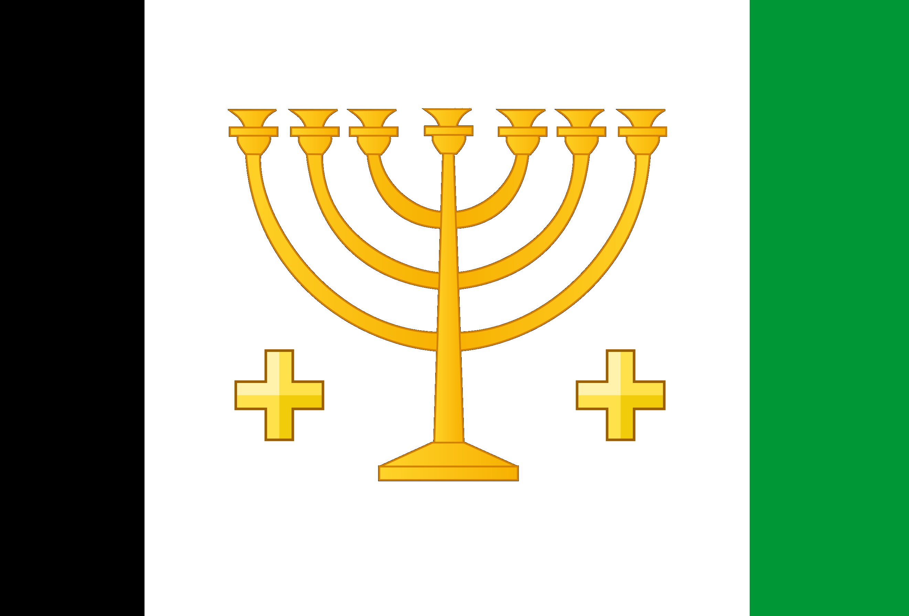

# Palestinians

### A Defensive and Siege civilization

## Goals

 - This is a Recraft of the [Outremarins](https://www.youtube.com/watch?v=OZ9wTwt8XkI) build by RobbyLAVA, as well as the associated builds by [Iron Kaiser Gaming](https://www.youtube.com/watch?v=6wUmio2UCXA) and [JimmyJames59](https://www.youtube.com/watch?v=QaC13z_vokQ). While those builds have a lot of interesting design ideas, I felt that focusing the build (not just in name but also design) on what is essentially a settled population and a hypothetical alternative history was disingenuous and erased the very real native people of the Holy Land. For an analogy, that would be like Age of Empires 3 having a civilization like the USA and Mexico, based on [Acadia](https://en.wikipedia.org/wiki/Acadia).
 - While I did get some ideas while watching these builds, I made a conscious effort not to reuse their mechanics, and instead just build on the same historical justifications.
 - I usually try to strike a balance between gameplay, aesthetic and history, so the build might not stand up to particular historical scrutiny in some aspects, and is mostly based around a few kernels of history made to flow nicely in Age of Empires 2 gameplay.
 - Given the nature of warfare and diplomacy during the Crusades, I wanted to design this civilization to lean into bonuses for non-Conquest game modes, without relying on them for viability and being weak in Conquest.
 - I intentionally avoided the Turcopoles as a unique unit or bonus since they are already represented in the Byzantine cheaper counter unit bonus. Representing them as a bonus would necessarily step on the Byzantines' toes (and I don't want to redesign what's probably the best designed civilization in Age of Empires 2), whereas representing them as a unit would be difficult as they served in a wide variety of roles. I may walk this decision back in a later update though.
 - Additionally, I felt that the Crusader States themselves were very firmly represented in existing European civilizations (**Franks** with the Cavalry hit point bonus and Castle discount, as well as **Outremarins** being a French word, **Teutons** with the Teutonic Knight, Herbal medicine, Crenellations and Conversion Resistance, **Sicilians** with First Crusade, and **Byzantines** with the Monk healing bonus and the cheaper counter units referencing Turcopoles), and as such did not need a dedicated civilization for their colonization of the Holy Land, and have consciously avoided similar design elements, opting instead for similarities in the tech tree and playstyle to echo the influence these civilizations would have had.

## Scope

 - My starting point, which I had voiced my thoughts about even before these builds came about, was that I found it ridiculous that Jerusalem was represented in the campaigns by no fewer than 3 different factions: **Saracens** in [The Emperor Sleeping](https://ageofempires.fandom.com/wiki/The_Emperor_Sleeping), **Byzantines** in [The Siege Of Jerusalem](https://ageofempires.fandom.com/wiki/The_Siege_of_Jerusalem) and **Franks** in [The Lion And The Demon](https://ageofempires.fandom.com/wiki/The_Lion_and_the_Demon), despite all three of these taking place between 1187 and 1191.
 - I set out to create a build that would cover a similar basic scope to the builds mentioned above - the people of Palestine and Lebanon in the era of the Crusades - primarily between 1095 and 1291 - and particularly a civilization that would be able to accurately represent Palestine under both Christian and Muslim control.
   - This is on the narrower side of AoE2 civilization scopes, but not unheard of - **Goths**, **Huns** and **Romans** all have shorter scopes outlined in their History sections, and the scopes as shown by the design of **Persians** (Sassanids) and **Vikings** (the Viking Age) are not significantly longer.
   - While an argument could be made (and in the case of **Huns**, **Goths** and **Romans**, *has* been made) that such a short timeframe would indicate that a civilization should not be in the game, in this case this narrow scope is just a focus of the design - similarly to how the Britons civilization primarily focuses on post-Norman England, despite being technically applicable as early as 410 in [Vortigern](https://ageofempires.fandom.com/wiki/Vortigern).

## Name

 - A potential alternative name for this civilization could be **Levantines**. While potentially more accurate - Crusader states did span more than just Palestine - this feels clunky, as the Levant was always just used as the name of a region and not a people; it'd like calling a civilization **Iberians** or **Scandinavians**.
 - **Outremarins**, while problematic for the reasons outlined above, and being an English plural of a French word for "overseas", is not an *unreasonable* choice - exonyms are used for multiple civilizations already, even if endonyms exist in English, e.g.
   - **Georgians** - refer to themselves as Kartvelians, which exists as a linguistic term
   - **Bohemians** - refer to themselves as Czechs, which is also commonly used in English
   - **Berbers** - refer to themselves as Amazigh/Imazighen, both of which are occasionally, academically rather than colloquially, used in English
   - **Byzantines** - would have called themselves Rhomaioi, meaning Romans, both existing as terms in English
     - Use of the term Byzantine is also anachronistic, only entering use in the late 15th century after the empire's ultimate fall, whereas Rhomaioi was used as late as the late 19th century
 - However, I ultimately chose the name **Palestinians** for, as it were, "out of game" reasons:  
 Even if we were to disregard the entirety of the existing game and focus solely on the theorycrafting at hand, I still believe that it's important to consider the messaging being done by any published work.  
 A theorycrafted build focusing on this area and this period being called after the European settlers sends a message that those were the important people in that time and place, and that the native people can be disregarded - despite those settlers eventually being driven out, while the native people remained.  
 In the context of a world where a genocide is currently being carried out in this very place to those very people, I believe it is at best clueless and at worst insidious to see a place where a vibrant exchange of cultures is happening, and focus on the white people coming in with massive armies to subjugate the local population in the name of religion.  
 My intent here is specifically to bring attention to the fact that Palestine was never "a land without a people", nor was it "colonized by Arabs", nor are Palestinian people "nomads with no home", nor are they indistinguishable from Syrians, Arabians, Egyptians and other ethnic groups.
 - An additional minor reason for this name is that the current top ranked player in the world, [Hera](https://liquipedia.net/ageofempires/Hera), is of Palestinian origin. 

## Civilization Bonuses

 - **Olive Groves**
   - Have access to Olive Groves instead of Farms.
   - Olive Groves cost 80 wood and have half the hit points of Farms.
   - Olive Groves have 900 food, but are not affected by Mill Upgrades.
   - This will be your primary economy bonus, and replaces the Mill upgrades. You will have significant resource savings from skipping Mill upgrades and not needing to reseed as often, but your farming economy will be more vulnerable. Given the wood savings you will still be net positive for resources, even with the slower gather rate from lacking Heavy Plow, so you will definitely need an adjusted build order.
   - Olives were the primary crop of historic Palestine for centuries and no build in the region would be complete without referencing them. Olives are slow to grow and start yielding, but when they do the trees can produce crops for centuries if not destroyed. Destruction of historic olive groves has been used to devastate and uproot settled Palestinian communities, showcased here in the reduced hit points, increased cost and slower gather rate.
 - **Pilgrims**
   - Castles and Captured Relics increase training speed and reduce training costs.
   - For every Castle standing, human units train in 1% less time and cost 1% less.
   - For every Relic captured, human units train in 2% less time and cost 2% less.
   - Stacks up to a total of 15 percentage points in any combination.
   - Human units refers to all units that are neither Siege nor Ships.
   - This will be your primary military and economy bonus.
   - Pilgrims and immigrants in general were incredibly important to the economy of the Holy Land, and this is used to represent the flow of people to the region based on how strong your established control of the region is.
   - Over its history, Palestine has seen many different populations settle and use immigration to establish control, from the time the ancient Israelites arrived in what was then known as Canaan, up to the modern day.
 - **Ziyar**
   - Mangonel line units' damage increased against ships by 25%, all other units increased by 10%.
   - Mangonel projectile speed increased by 20%.
   - The Ziyar was a torsion-powered siege engine widely used in the Muslim world.
   - The motivation for the bonus here is primarily gameplay oriented, since this build lacks punch in early Castle Age when the impact of **Olive Groves** is diminishing, but **Pilgrims** has not yet had an effect. This will give the player a distinct advantage in early Mangonel wars, as well as increase their versatility into the late game.  
   - Most importantly it will help players bridge the skill gap necessary to trade by effectively increasing the hit radius sufficient to one-shot an enemy Mangonel or group of Crossbows. With these fights hinging on a few hit points, the damage only being increased by 10% is intended to make all the difference there, rather than make Mangonels viable against Towers or cavalry or something else.  
   - This is also intended to echo the Saracen Counterweights technology. 
 - **Pioneering Siegecraft**
   - Rams cost 50% less gold, Siege Towers cost no gold.
   - This is primarily based on the Siege of Jerusalem in 1099 during the First Crusade, where the Crusader armies hastily made high quality siege towers with limited resoureces.
   - The total savings on Rams are comparable to the Slavs' bonus, though leaning more towards gold, which will make it easier to tear down enemy bases in the late game.
   - Siege Towers already don't see a lot of play so I could see this even being a general change to them for all civilizations.
 - **Kingship through Conquest**
   - In Regicide game mode, Kings have double HP and behave as captured Relics for the purposes of **Divine Inspiration**.
   - The position of the King of Jerusalem was a highly prestigious one and the king's presence commanded both secular and religious respect. The Kingdom of Jerusalem and the other Crusader states were established through outside conquest, with the new rulers all being central fighting figures in these wars. As such, the presence of the King on the battlefield brings fervor to his army in a way different from most.
   - Having your King, even garrisoned in a Castle, will be a significant defensive boost if the enemy is in your base.

## Team Bonus

 - **Holy Land**
   - Relic, Wonder and Monument victories count down 20% faster. (Finish in 16% less time.)
   - Relics count as captured while they are being carried for the purposes of gold generation, Relic victory, **Hospitals** and **Divine Inspiration**.
     - So, the only scenario where a Relic doesn't count as captured while carried is for the purposes of victory in a Capture the Relic game.

## Unique Techs

### Castle Age: Hospitals

 - Cost: 350 food, 200 gold
 - Research time: 90 seconds
 - Monasteries and Captured Relics heal nearby units for 20 hit points per minute.
 - Monasteries have a range of 5 tiles from the edge in a square shape (similar to [Stronghold](https://ageofempires.fandom.com/wiki/Stronghold_(Age_of_Empires_II)) and the [Caravanserai](https://ageofempires.fandom.com/wiki/Caravanserai_(Age_of_Empires_II))), whereas Carried Relics a range of 10 tiles in a circular shape from the center of the unit (similar to the [Centurion](https://ageofempires.fandom.com/wiki/Centurion_(Age_of_Empires_II)) aura).
 - This effect does not stack on the same unit.
 - The Hospitaller order was founded in Jerusalem, where they healed the sick and wounded both in their temples and in the field of battle.

### Imperial Age: Divine Inspiration

 - Cost: 500 food, 500 gold
 - Research time: 90 seconds
 - Captured Relics give nearby units 1 of every kind of armor (including armor against bonus damage).
 - Monasteries have a range of 5 tiles from the edge in a square shape (similar to [Stronghold](https://ageofempires.fandom.com/wiki/Stronghold_(Age_of_Empires_II)) and the [Caravanserai](https://ageofempires.fandom.com/wiki/Caravanserai_(Age_of_Empires_II))), whereas Carried Relics a range of 10 tiles in a circular shape from the center of the unit (similar to the [Centurion](https://ageofempires.fandom.com/wiki/Centurion_(Age_of_Empires_II)) aura).
 - This effect does not stack more than once on each unit.
 - This affects only the player's own units, not those of their allies.
 - Both Crusader and Muslim forces during the crusades were known to carry holy relics in order to inspire their troops, such as in [The Horns of Hattin](https://ageofempires.fandom.com/wiki/The_Horns_of_Hattin_(Age_of_Empires_II)).
 - Carrying Relics always carries a risk, but the reward could potentially be substantial with masses of weaker units, like in trash wars.

## Unique Units

### Fereter Caravan

 - Support unit
 - Cost: 100 wood, 60 gold
 - Non-Elite Unit Stats
   - 100 Hit Points
   - No attack of any kind
   - 1/4 armor
   - 2 Monk armor
   - 10 Siege Weapon armor
   - 0.65 movement speed
   - 10 line of sight
   - Trained in 60 seconds
   - 5 garrison space
     - Only Villagers, Monks, Kings and Relics can be garrisoned.
     - Movement speed increased by 0.05 per garrisoned Villager (same as Rams with garrisoned Infantry).
   - Can pick up Relics.
     - Relics take up one garrison space each and count as carried while garrisoned.
   - Affected by Monk upgrades, Sanctity for 15 Hit Points, Fervor for faster movement, and needs Atonement before it can be converted.
   - Like a Ram, it needs to be converted from melee range, and is repaired rather than healed.
   - Unlike a Ram, is affected by **Pilgrims**.
   - Like a Mule Cart, it is affected by Town Watch and Town Patrol.
   - Unlike a Mule Cart, is not affected by other Building upgrades, cannot garrison inside buildings, and does take up population.
 - Elite Upgrade Cost: 500 food, 250 gold
 - Elite Upgrade research time: 45 seconds
 - Elite Unit Stats
   - 130 Hit Points
   - 3/6 Armor
   - 4 Monk Armor
   - Relics carried have 20% increased range for the effects of **Hospitals** and **Divine Inspiration**.
 - The motivation for this unique unit was more mechanical than historical, playing into the civilization's team bonus and the **Divine Inspiration** unique tech by allowing you to carry relics in a unit tankier than a Monk.
 - Given the very wide tech tree, this civ already has access to most combinations of units, so I knew I didn't want a military unit.
 - I wanted to avoid using any units that were specific to the Crusader or Muslim armies that were occupying Palestine, and this seemed like an appropriate middle ground, as well as a way to power up use of **Divine Inspiration**.
 - It has secondary utility as a unit with an unusually high line of sight - 18 in Castle Age with Town Patrol researched.
 - Tertiarily, it provides a way to shuttle Villagers, Monks and Kings around the map slightly more safely - while Villagers can garrison in Rams and Siege Towers, they don't increase their movement speed, and Monks and Kings cannot garrison into Rams and Siege Towers at all.
 - This unit is intended to be less vulnerable to Light Cavalry and Eagles than regular Monks, but more expensive and more vulnerable to siege.
   - The 10 Siege Weapon armor is intended to avoid receiving anti-siege bonus damage from Eagles, Mangudai and Magyar Huszar, but still take bonus damage from Mangonels, Bombard Cannons, Rams etc.
 - The unit is intentionally very slow - it provides massively improved safety for a carried Relic compared to a Monk, so it is only fair that its use necessitates attention and care and comes with some risk.
   - For reference, 0.65 is the original movement speed of a Teutonic Knight from Age of Kings.

## Tech Tree

 - Barracks:
   - Missing Eagle Warrior Line.
   - Missing Squires.
 - Archery Range
   - Missing Hand Cannoneer.
     - This build is primarily focused on the Levant before the age of gunpowder.
   - Missing Elephant Archer line.
   - Missing Parthian Tactics.
 - Stable
   - Missing Hussar.
     - Between the Crusader and the Muslim armies, this is a rare civilization where having both Paladin and Heavy Camel Rider fully upgraded is justified. 
     - This was previously only available to the Persians and was a focus of the civilization - effectively another bonus. However, keeping in mind that this civilization does not have the Persians' economy bonus, I feel like it does not warrant the same restrictions in other parts of the tech tree as Persians (missing Two-Handed Swordsman, Bracer).
     - Missing Hussar mostly for balance rather than historical reasons. Between the Pilgrims bonus and the long lasting farms, this would be the ultimate Hera civ if they had Hussar - which would be very apt with him being of Palestinian origin.
   - Missing Steppe Lancer Line.
   - Missing Battle Elephant Line.
 - Siege Workshop
   - Missing Bombard Cannon.
   - Missing Armored Elephant Line.
 - Blacksmith: Full
   - Due to the variety of cultures present in the region, most unit lines are open and not missing upgrades, leaving you with many options to choose from. Flexibility is key when your bonuses all kick in so late.
 - Monastery:
   - Missing Atonement, Theocracy, Illumination.
   - Due to the religious diversity inherent in the region, the power of any one church to draw converts from another is limited.
   - From a gameplay point of view, you are already highly incentivized to use Monks for the Relics, so offensive use of Monks is weakened to offset that. (For the purposes of this, I consider Redemption to be a defensive tech.)
 - Castle: Full
   - Crusader fortifications are famously extensive and advanced. 
   - Your game plan depends on being able to keep Castles standing in late Castle Age onwards. Having access to Hoardings and Conscription is crucial here.
 - Market: Full
   - Palestine was one of the wealthiest provinces of the Caliphate during the Rashidun era, largely due to its vital position in the Mediterranean trade network.
 - University
   - Missing Bombard Tower.
 - Dock
   - Missing Cannon Galleon Line
   - Missing Dromon.
   - Missing Shipwright.
   - Palestine was not known for its shipyards and has few good natural harbors, but I'm mostly removing this for balance reasons and because of free Siege Engineers.
 - Mill: Empty
 - Lumber Camp:
   - Missing Two-Man Saw
 - Mining Camp
   - Missing Gold Shaft Mining
   - Late game economy techs removed to balance against the cumulative effect of **Pilgrims** in the late game as you establish map control - in the mid game you will have the full effect, but as the game drags on you will need to rely on Castles and Relics, since stone mining, Relics and trade are your only fully upgraded resource incomes.

## Architecture: Mediterranean and Middle-Eastern hybrid (new)

 - Castle Skin: [Krak des Chevaliers](https://en.wikipedia.org/wiki/Krak_des_Chevaliers)
   - 
   - I feel like this is a fairly obvious pick. It is the most famous and notable Crusader fortress, even if it was not originally built by the Crusaders and does not lie strictly within Palestine and Lebanon - it is inextricably tied to the central design elements behind this civilization.
   - Its most famous form is a result of significant modifications by the Crusaders, so its original Kurdish form can, in my opinion, still be used for a Kurdish Castle, though more notable ones exist.
 - Wonder Skin: [Dome of the Rock](https://ageofempires.fandom.com/wiki/Dome_of_the_Rock)
   - 
   - It is one of the most important landmarks of Jerusalem, it is important to all three Abrahamic faiths, making it culture neutral, and it is already in the game, making it the obvious choice for this civilization.
   - While the gilded dome is anachronistic, I think the current design would fit better with the rest of the architecture set than the original black.
 - Buildings would have components of both architectures in every sprite, showing how Christians and Muslims had lived side by side.
   - For example, the Town Center would have Mediterranean style pillars and arches, but a Middle-Eastern style roof and awnings.
 - The exception to this would be the Monastery, which, similarly to how there are multiple different House sprites, with one selected at random when placing, would be either a Mediterranean monastery, a Middle-Eastern mosque or a new  Synagogue sprite to represent the Mizrahim.
 - This architecture style could also be used for Sicilians, Andalusians, and perhaps a few other civilizations where the Christian and Muslim worlds coexisted.
 - Unique Olive Grove skin for the Farm.

## Language:

 - I have a few options for unit languages here ranging from very complex to very simple.
 - In all of these, ideally every unit would be assigned a language when created and would only speak that language.
   - I think it's possible to implement this in a similar way to how Male and Female Villagers are implemented, where they are two different units internally, but are created by the same unit spawn action, can be double-click selected together etc.
   - Therefore, this would require every unit to have internal copies for every language here, except for some special cases.
 - Option 1: Very Multicultural
   - [Middle Aramaic](https://en.wikipedia.org/wiki/Aramaic#Middle_Aramaic)
   - [Byzantine Greek](https://en.wikipedia.org/wiki/Medieval_Greek) (should also be used for Byzantines instead of Latin)
   - [Classical Arabic](https://en.wikipedia.org/wiki/Classical_Arabic) (can reuse Saracen voice lines)
   - [Old French](https://en.wikipedia.org/wiki/Old_French) (can reuse Frank voice lines)
   - [Church Latin](https://en.wikipedia.org/wiki/Carolingian_Renaissance#Reform_of_Latin_pronunciation)
   - [Mizrahi Hebrew](https://en.wikipedia.org/wiki/Mizrahi_Hebrew)
   - Old French would only spawn on Swordsman, Archer and Knight line units.
   - Camel Riders would only ever spawn with Classical Arabic or Middle Aramaic.
   - Monks would only spawn with Church Latin, Mizrahi Hebrew, Byzantine Greek, or Classical Arabic.
   - Church Latin and Mizrahi Hebrew would only spawn on Monks.
   - This is a rather large pool of languages (probably the largest sensible for any civilization), but I feel it is warranted to showcase the diversity of cultures in the region.
 - Option 2: Slightly toned down
   - [Middle Aramaic](https://en.wikipedia.org/wiki/Aramaic#Middle_Aramaic)
   - [Byzantine Greek](https://en.wikipedia.org/wiki/Medieval_Greek)
   - [Classical Arabic](https://en.wikipedia.org/wiki/Classical_Arabic)
   - This is a simplified version of the first option. Most civilizations only have one language, and the ones that have two usually do so only for particular units (e.g. how for Britons Monks and Kings speak Latin), so this is pushing the boundary only a little bit.
 - Option 3: If I had to choose one
   - [Middle Aramaic](https://en.wikipedia.org/wiki/Aramaic#Middle_Aramaic)
   - While Arabic would have probably already been the lingua franca in the Levant around the time of the Crusades, the Saracens already use that language (and certainly many of their split civilizations would keep it), so I wanted to choose something more distinctive. Multiple variants of Middle Aramaic (e.g. [Jewish Palestinian Aramaic](https://en.wikipedia.org/wiki/Jewish_Palestinian_Aramaic) and [Christian Palestinian Aramaic](https://en.wikipedia.org/wiki/Christian_Palestinian_Aramaic)) have been widely spoken across Palestine since late antiquity and have lasted through most of the medieval period.

## AI Player Names

 - [Julianus Ben Sabar](https://en.wikipedia.org/wiki/Julianus_ben_Sabar)
   - Jewish commander during the Samaritan revolts.
 - [Nehemiah ben Hushiel](https://en.wikipedia.org/wiki/Nehemiah_ben_Hushiel)
   - Jewish commander during the Jewish Revolt against Heraclius.
 - [Benjamin of Tiberias](https://en.wikipedia.org/wiki/Benjamin_of_Tiberias)
   - Jewish commander during the Jewish Revolt against Heraclius.
 - [Zacharias of Jerusalem](https://en.wikipedia.org/wiki/Zacharias_of_Jerusalem)
   - Byzantine Patriarch of Jerusalem, prominent figure in the Jewish Revolt against Heraclius.
 - [Sophronius the Sophist](https://en.wikipedia.org/wiki/Sophronius_of_Jerusalem)
   - Byzantine Patriarch of Jerusalem who negotiated the surrender of Jerusalem to the Rashidun Caliphate.
 - [Amr ibn al-As](https://en.wikipedia.org/wiki/Amr_ibn_al-As)
   - Rashidun commander who conquered most of Palestine, and its first governor under Caliphate rule.
 - [Yazid ibn Abi Sufyan](https://en.wikipedia.org/wiki/Yazid_ibn_Abi_Sufyan)
   - Rashidun governor of Palestine, Damascus and Jordan.
 - [Alqama ibn Mujazziz al-Kinani](https://en.wikipedia.org/wiki/Alqama_ibn_Mujazziz_al-Kinani)
   - Early Rashidun governor of Palestine.
 - [Jabala ibn al-Ayham](https://en.wikipedia.org/wiki/Jabala_ibn_al-Ayham)
   - Arab Christian (Ghassanid) commander from Transjordan fighting for the Byzantine Empire against the Rashidun Caliphate in Palestine.
 - [Theodore the Sacellarius](https://en.wikipedia.org/wiki/Theodore_Trithyrius)
   - Byzantine commander who fought against the Rashidun Caliphate in Palestine.
 - [Vahan](https://en.wikipedia.org/wiki/Vahan_(Byzantine_commander))
   - Armenian commander fighting for the Byzantine Empire against the Rashidun Caliphate in Palestine.
 - [Yahya ibn al-Hakam](https://en.wikipedia.org/wiki/Yahya_ibn_al-Hakam)
   - Umayyad governor of Palestine.
 - [Sulayman ibn Abd al-Malik](https://en.wikipedia.org/wiki/Sulayman_ibn_Abd_al-Malik)
   - Umayyad governor of Palestine. Later, Seventh Umayyad Caliph, ruled from Palestine.
 - [Bugha the Cupbearer](https://en.wikipedia.org/wiki/Bugha_al-Sharabi)
   - Abbasid governor of Palestine.
 - [Anushtakin al-Dizbari](https://en.wikipedia.org/wiki/Anushtakin_al-Dizbari)
   - Late Fatimid governor of Palestine.
 - [Godfrey of Boullion](https://en.wikipedia.org/wiki/Godfrey_of_Bouillon)
   - Leader of the First Crusade, King of Jerusalem.
 - [Raymond of Toulouse](https://en.wikipedia.org/wiki/Raymond_IV,_Count_of_Toulouse)
   - Leader of the First Crusade, Count of Tripoli.
 - [Baldwin I](https://en.wikipedia.org/wiki/Baldwin_I_of_Jerusalem)
   - Crusader Count of Edessa and King of Jerusalem.
 - [Tancred of Galilee](https://en.wikipedia.org/wiki/Tancred,_Prince_of_Galilee)
   - Crusader Prince of Galilee, regent of the Principality of Antioch.
 - [Reginald of Sidon](https://en.wikipedia.org/wiki/Reginald_of_Sidon)
   - Crusader Lord of Sidon.
 - [Bohemond of Antioch](https://en.wikipedia.org/wiki/Bohemond_III_of_Antioch)
   - Crusader Prince of Antioch.
 - [John of Ibelin](https://en.wikipedia.org/wiki/John,_Old_Lord_of_Beirut)
   - Crusader Lord of Beirut.
 - [Al-Mu'azzam Isa](https://en.wikipedia.org/wiki/Al-Mu%27azzam_Isa)
   - Ayyubid Emir of Damascus, ruled from Jerusalem.
 - [Siraj al-Din Dhabyan](https://en.wikipedia.org/wiki/Siraj_al-Din_Dhabyan)
   - Ayyubid commander at the siege of Acre.

## Sigil

 - Due to the inherent diversity represented in this build, any choice of sigil is going to necessarily represent only a fraction of the history.
 - An obvious choice is the Cross of Jerusalem, due to its recognizability and the central role the Kingdom of Jerusalem plays in this build. I hesitate to use it, however, due to the similarity that it bears to the already existing sigil of the [Georgians](https://ageofempires.fandom.com/wiki/Georgians).  
  
 - On the other hand, the other Crusader States have very uninteresting flags and coats of arms.
 - Another option is the Jewish Menorah, since this is probably the closest to a Jewish civilization that Age of Empires 2 can have, it is very recognizable as a symbol of the Jewish people, but unlike the Star of David, it has not been tainted by association with genocide.
  
 - The Druze Star is another symbol for an often forgotten group of people from this area - the Druze religion started out in the early 11th century. However, I was unable to verify that the star was used in this form during the Middle Ages - and it looks a bit too modern for an AoE2 sigil anyway with 5 evenly distributed colors.   
  
 - The modern flag of Palestine, while wildly anachronistic, takes in elements from the banners of the Abbasid (black), Umayyad (white) and Fatimid (green) dynasties, all of which are relevant to this time period, but none of which could alone be justified in its use. Abbasid Black is also already used for the current [Saracens](https://ageofempires.fandom.com/wiki/Saracens) sigil.  
   
 - All in all, I think some creative liberty is warranted based on the symbology present in creating a sigil.  
 A very bad artist's sketch that hopefully isn't too busy:   
   

## Jingle

 - I have not yet found a jingle I am satisfied with.

## Campaign

 - If any civilization deserved a proper [Bari](https://ageofempires.fandom.com/wiki/Bari)-style campaign focused on a location rather than a character or even a dynasty, it would be this one. A campaign centered on Jerusalem could follow it from the Jewish revolts against the Romans to the end of the Crusader era.
 - Alternatively, a campaign focused on Lebanon, detailing the back and forth of small local rulers of many different religions under distant imperial rule could allow for some interesting mechanics. Here I am primarily inspired by [this](https://www.youtube.com/watch?v=HqiJ58NN1cc) series of videos by the amazing channel Rare Earth and want to use Age of Empires 2 as a vessel for that narrative.

## Game Plan

 - You can count on saving 150 resources in Feudal Age for not needing Horse Collar, but that' s about it, so you need to make it count. This saving is less than many other economic bonuses net in the early game, so you will want to avoid early engagements and focus on getting to Castle Age where your other bonuses start having an effect.
 - While your tech tree is very open, delaying Castle Age will be detrimental against many civilizations with more concrete bonuses, so I don't expect Archer or Scout rushes to be used very often.
   - Notably, if both you and your enemy are stuck in Feudal after a failed rush or on a very confined map where towers are in the picture, your farming bonus will kick in eventually regardless of whether you reach Castle Age, giving you the interesting distinction of being good in prolonged Feudal wars, just not in short ones. Your enemy will probably try to target your farms if they can, underscoring the importance of placing them safely.
   - Testing will show whether farms at 240 HP can be destroyed reasonably quickly, and the bonus may be tweaked based on that. I want it to be worthwhile for your enemy to at least threaten your Farms with destruction, if not destroy them outright.
 - By Castle Age your farming bonus will start catching up with your enemy and you will be able to invest the extra villager work time into a Knight rush, a Monk and Siege push or a forward Castle. You will want to build a Castle in basically every game you can as this will power up your Pilgrims bonus and allow you to research your Unique Techs.
 - Due to the importance of relics, you will definitely want to fight for them, but your enemy will also know this and may contest them more than usual due to their higher significance to you. You can count on a bit of extra gold when first collecting them from the time they are carried to the Monastery, though this is probably not a very significant aspect of the bonus.
 - Since you will almost certainly have Monks out anyway, and your siege has bonuses of its own, I see a Monk and Siege push as a very powerful strategy for this civilization. Your savings on Rams are comparable to Slavs, and your Mangonels will have an easier time trading with enemy Mangonels. Notably, Siege is affected by Hospitals, so forward Monasteries can be a worthwhile investment next to a forward Castle.
 - If you take careful fights and don't lose Relics or Castles, you will be rewarded with cost efficiency and faster training, but more aggressive playstyles may lose you this edge. The best players will know how to keep this balance. Your bonuses are versatile, but not very powerful.
 - Combining Castles and Monasteries can be huge for map control, while **Divine Inspiration** and **Fereter Caravan** will be very important for holding or advancing any frontline.
 - Since **Fereter Caravan** is not particularly useful without a Relic or King garrisoned, your Castles will generally not be occupied making them, so they can spend time researching Unique Techs and creating Trebuchets without much opportunity cost. It is for this reason that both Unique Techs take such a long time to research, and why **Fereter Caravans** themselves take so long to create.
 - The effect of **Divine Inspiration** on bonus damage mechanics in trash wars should not be underestimated. While Hussar taking 37 instead of 39 damage from Halberdiers is hardly relevant, Halberdiers taking 5 instead of 7 damage from Elite Skirmishers will surely paint a target on any Relic being carried nearby. It is for this reason that the range is reduced when garrisoned in a Monastery, as it would be practically impossible to snipe at 10 range.

## Summary

 - This civilization has an incredibly wide tech tree reflecting the huge diversity in the population, but this diversity also brings mostly nonspecific bonuses, meaning you will never be overpoweringly strong in any situation. While you do have almost every unit and combination of units in the game, your bonuses also don't kick in until Castle Age, so you will need to be flexible in order to avoid getting overpowered by civilizations with earlier bonuses.
 - Your units being cheaper and produced faster means you will usually be able to trade well, but a lack of any direct military bonus for non-siege units means that you will need to be smart about which fights you take.
 - The build is intentionally focused to have specific vulnerabilities that will punish bad decisions and reward good ones. Losing farms or relics can be more punishing for you than for other civilizations as this civilization is dependent on them for its unique playstyle, but making good use of them can yield great results.
 - I wanted to make a parallel with the Byzantines (which were previously used to represent the Kingdom of Jerusalem in the Saladin campaign pre-Definitive Edition). Both civilizations have good defences, wide tech trees, are lacking in raw power, and have a generic Dark Age - the differences being that where Byzantines have gunpowder, this civilization has Bloodlines, Siege Onager and Siege Engineers.
 - Notable parallels also include Sicilians, as another hybrid Christian-Muslim civ (or at least one that should be), with the high yield farms, and Saracens, with the wide tech tree, area of effect healing, and harder hitting Mangonels.

## Considerations of changes to other Civilizations or the common Tech Tree

 - This civilization is a *reasonable* candidate to have access to the [Madrasah](../Buildings/Madrasah.md).  
   - Pros:
     - The civilization has a partial Monk focus and wide tech tree.
     - This would give the civilization more options in early Castle Age, especially in very competitive Relic races against civilizations with actual early game economy bonuses.
   - Cons:
     - The Relic identity would definitely be less flavorful if they were garrisoned in a building that's not explicitly a Monastery, especially if the civilization is intended to have multple Monastery skins to represent the diversity of people living there.
     - Palestine was not a huge center of Islamic learning like Baghdad, Damascus or Alexandria were.

## Tabled Ideas

 - I was strongly considering having Kings also generate gold like Relics in Regicide game mode (even as a team bonus), but I found it difficult to balance, and even justify - why would the early game, when everyone is building up anyway, be more forgiving for this civilization in Regicide than Conquest?
 - I also considered having their King be a fighter via the **Kingship through Conquest** bonus, but I thought that what is essentially a second scout might be a bit oppressive for dark age rushing, so I ended up settling for greater durability and more of a late game focus.
 - I originally capped the effect of **Pilgrims** for both Relics and Castles to 5 each, to encourage diversifying, but I have come to see that this can somewhat limit strategies for situations such as maps with fewer than 5 Relics, unlucky spawn points, uncooperative teammates, etc. For this reason I ended up changing it to just limiting the total effect. While this may have a disproportionate effect on larger maps, many civilizations have bonuses that disproportionately benefit them when playing inappropriate map sizes for the number of players, so I didn't want to optimize for that scenario.

## Loose Threads

 - Does this build depend too heavily on Relics?
   - Three of their core mechanics are influenced by the number of Relics captured, which probably puts them in this win-more lose-more situation where their games tend to swing very hard depending on how the Relics spawn and how you contest them.
   - I did intend for this to be something that alters the game from the get-go, and Relics should be hotly contested in every game - similarly to the Cuman second Town Center, though some would say that that feature is not great design either.
   - I think that they are still viable even if they lose all the Relics - with wide tech tree, good siege, farming bonus, **Pilgrims** being fully utilizable through Castles alone, and **Hospitals** also working with just Monasteries.
   - They may end up being very oppressive if they manage to secure 5 or more Relics, but the same can be said for Lithuanians with 4 Relics, or even an unchecked Goth or Persian boom, so I don't think the consideration alone warrants nerfing - playtesting would show which aspects, if any, could end up being too strong.
 - Is the tech tree too open?
   - Generally civilizations with wide tech trees tend to lack eco bonuses (Byzantines, Magyars, Spanish), whereas civs with strong eco bonuses tend to be more restricted (or focused, depending on your perspective) (Huns, Mongols, Celts, Vikings, Persians). This civ's economy bonus doesn't tend to yield any resources until Castle Age (apart from the Horse Collar savings), which definitely tends more towards the former group.
   - The closest civ I can think of with a similar situation is Sicilians (they do need to research Horse Collar, but get more total food on Farms because of it, and they start with 100 more stone), all in all being 100ish resources ahead of a fully generic civ before Castle Age and only later benefitting from their bonus. Sicilians have a reasonably wide tech tree, but with some necessary gaps (Archery Range, defences) due to their bonus reducing bonus damage taken, as it's a much more explicit military bonus than anything from this build.
   - Another similar situation is with the Saracens, who have a very wide tech tree but whose only economy bonus, apart from the wood saving building the Market, usually doesn't kick in before Castle Age, and is more about flexibility and losing less rather than gaining more anyway.
   - Both these, and Byzantines mentioned above, still have more notable tech tree gaps - Sicilians have terrible Archers and Monks, Saracens don't have Cavalier or Halberdier, Byzantines don't have Bloodlines.
 - Are the Farms underpowered?
   - Even with the additional cost and vulnerability, they still don*t yield as much food as fully upgraded Sicilian farms, and those aren't considered overpowered, or even a significant bonus to the civilization. This does kick in earlier and have some savings on techs, but on the other hand you also gather slower.
   - I wanted to make the farms *different* rather than just *better*, but I'm not sure how big of an impact this would be.  
   (Warning, maths ahead, read **bold** for cliffnotes.)  
   - A generic civilization **in Feudal Age** with Horse Collar and Double-bit Axe needs about one lumberjack for every (250 food on farm / ~18 food per minute) / (60 wood per farm / ~20 wood per minute) = 13.(8) / 3 ~=4.5 farmers to keep them consistently reseeding.  
   Palestinians, on the other hand, need one lumberjack for every (900 food / 18 food per minute) / (80 wood per farm / ~20 wood per minute) = 50 / 4 = 12.5 farmers. Reversing the calculation, that means that for every farm you have, you save about 1/4.5 - 1/12.5 = 0.(2) - 0.08 ~= 0.14 ~= 1/7 of a lumberjack compared to the generic civ, or, **for every 7 farms, you have a free villager you can send somewhere else that a generic civ would need to keep on wood**.  
   - The calculation gets even less favourable for the Palestinians **in the late game**, where their gather rate on farms will lag behind other civilizations. I couldn't find accurate gather rates for Villagers with Hand Cart but not Heavy Plow (since that's a situation that basically never happens except maybe to Nicov), but **even with the most generous interpretation that farmers in that situation already bump into the farms' built in food production limit** (and thus the late game farming rates being the same), a generic civilization needs one lumberjack per (550 food per farm / 23.25 food per minute) / (60 wood per farm / 28 wood per minute) = ~23,5 / 2.14 ~= 11 farmers, whereas for the Palestinians this is (900 food per farm / 23.25 food per minute) / (80 wood per farm / 28 wood per minute) = ~38.7 / 2.85 ~= 13.5 farmers. Reversing the calculation again, this means that for every farm the Palestinians need 1/11 - 1/13.5 + 0.(09) - 0.(074) ~= 0.016 farmers, meaning that **you only get an extra villager you don't need to have on wood compared to a generic civilization for every 60 farmers**.
   - In Feudal or early Castle Age you can probably get a villager or even two working somewhere else, which is comparable to the impact of the Persian bonus up to that point (though with more resources invested to get there), but by late game this still ends up being only about one extra villager compared to a generic civ, which is not a lot in a 200 pop game. 
   - The impact is significantly greater **if your enemy doesn't get** (or doesn*t have) access to **Crop Rotation** (which a lot of pros argue is almost never worth it anyway since it takes too long to pay for its cost), since then your enemy will need one lumberjack for every (375 food per farm / 23.25 food per minute) / (60 wood per farm / 28 wood per minute) = 16.12 / 2.14 ~= 7.5 farmers, so **you are at an advantage of** 1/7.5 - 1/13.5 = 0.13 - 0.074 = 0.06 lumberjacks per farm, or **one lumberjack free per 16 farms** compared to the enemy. This is easily a third of the impact of Mahayana for free in the late game, on top of everything before.
   - Weirdly, this puts you in the situation where you may be at a greater advantage against a pro who chooses to not get Crop Rotation, over a low elo legend who gets it without realising it will take ~40 minutes to pay for itself.
   - The main impact is in Castle Age, when the first farms your enemy has placed are coming up to be reseeded, whereas yours won't be for another ~15 minutes, and you have what is effectively a villager advantage. This is giving you a resource advantage at a time when you can pull off literally almost any Castle Age strategy due to your very open tech tree.
   - It seems to me like no matter how I slice this the impact in late game is going to be minor, and it's primarily a timing bonus (maybe to help you put down your first Castles and get on the **Pilgrims** train). Is that okay? It is definitely weaker than the Persian, Malay, or Viking bonuses in the mid game (and it's supposed to be, those are all top tier bonuses), but I worry that you are not saving many resources, just freeing up villagers, and that this will not have a large impact at all and not make it worth the 3 maluses you get. (How) should I address this? Remove the higher cost maybe?